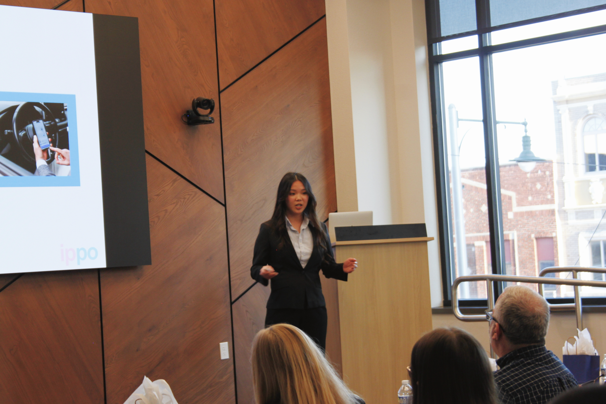
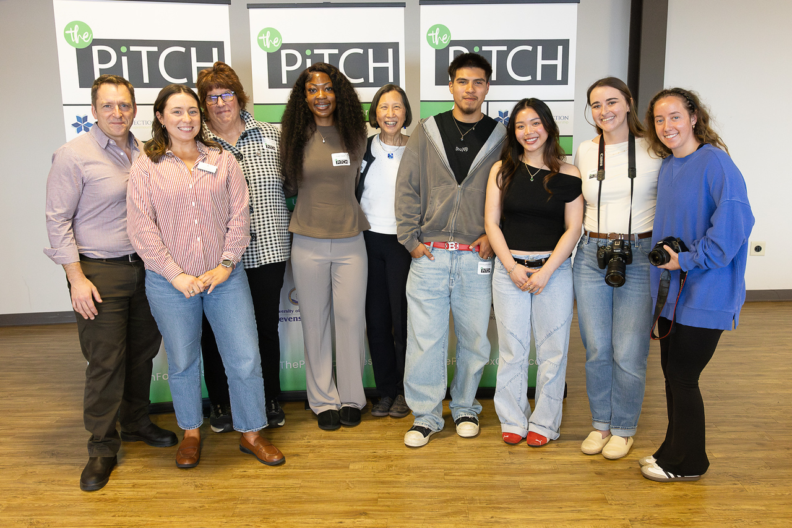
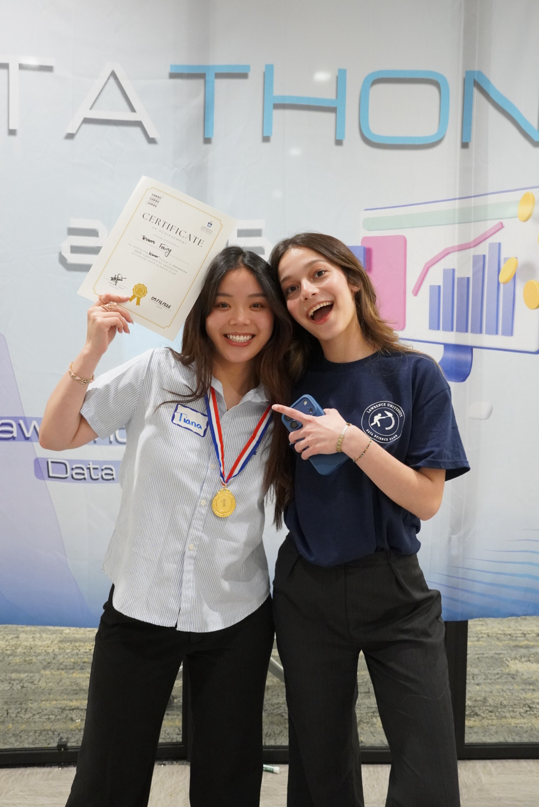
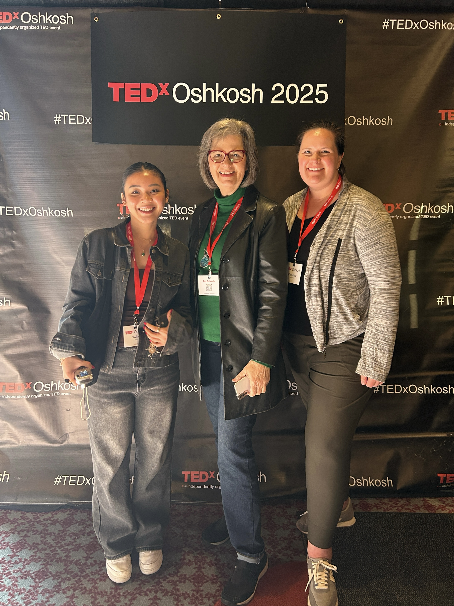
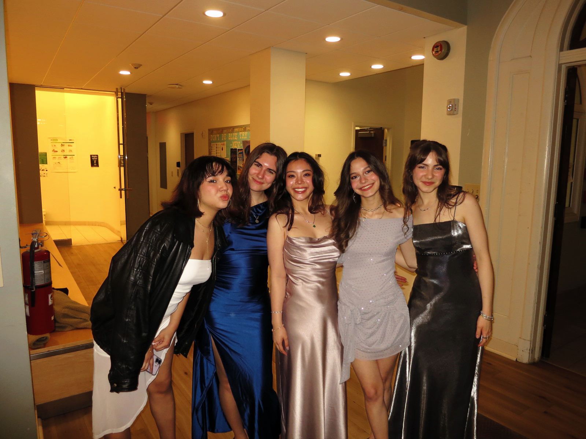
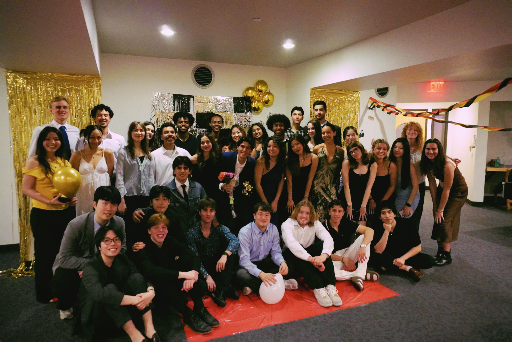
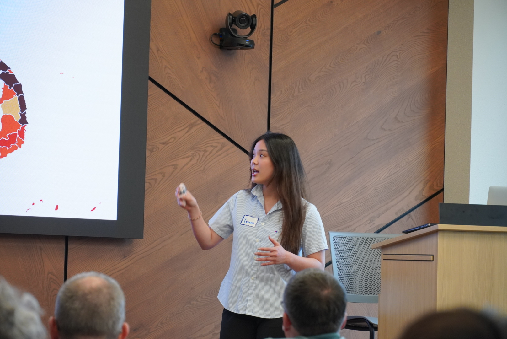
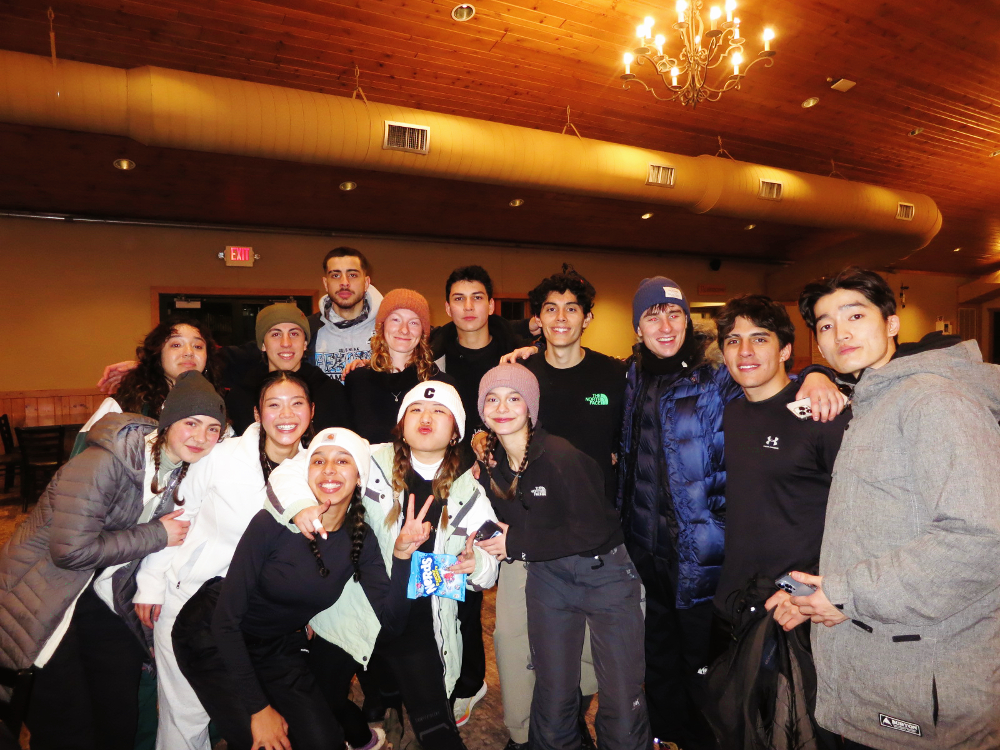
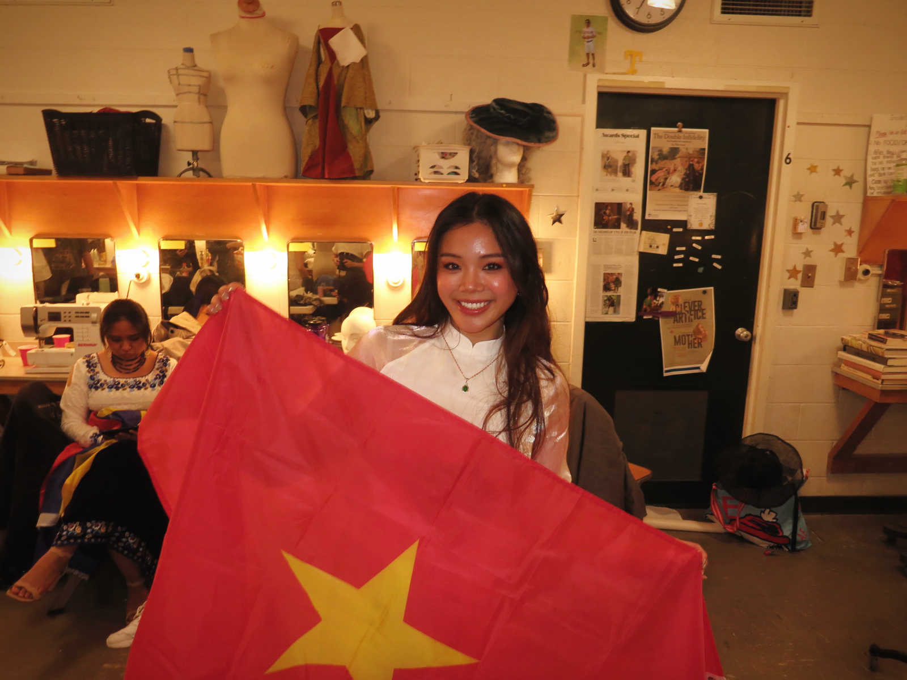

I have a strong interest in nonprofit work and startups alike. I love to explore the intersection of social impact and entrepreneurial thinking!

Earlier this term I participated in [The Pitch](https://thepitchfoxcities.com/)! competition, which i have learnt a lot from (more updates to come!) More recently, I competed in an annual datathon, where i was able to win first place with my analysis on the [impact of natural disaster on the vietnamese economy and people.](datathon.pdf)

I enjoy reading, volunteering for [habitat for humanity](https://www.foxcitieshabitat.org/), making clothes, working out, flying hot air balloons, badminton, doing photography and cinematography,..!

::: {layout-ncol=2}

:::
