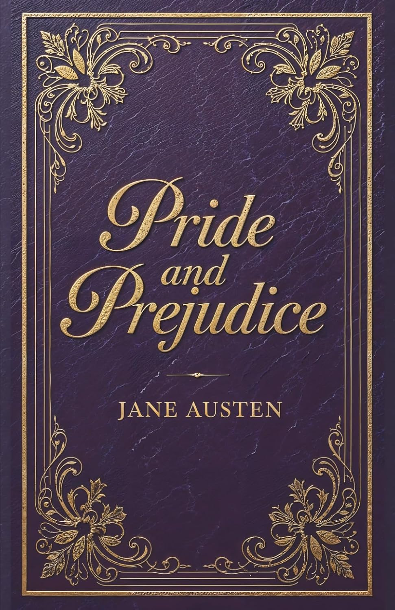
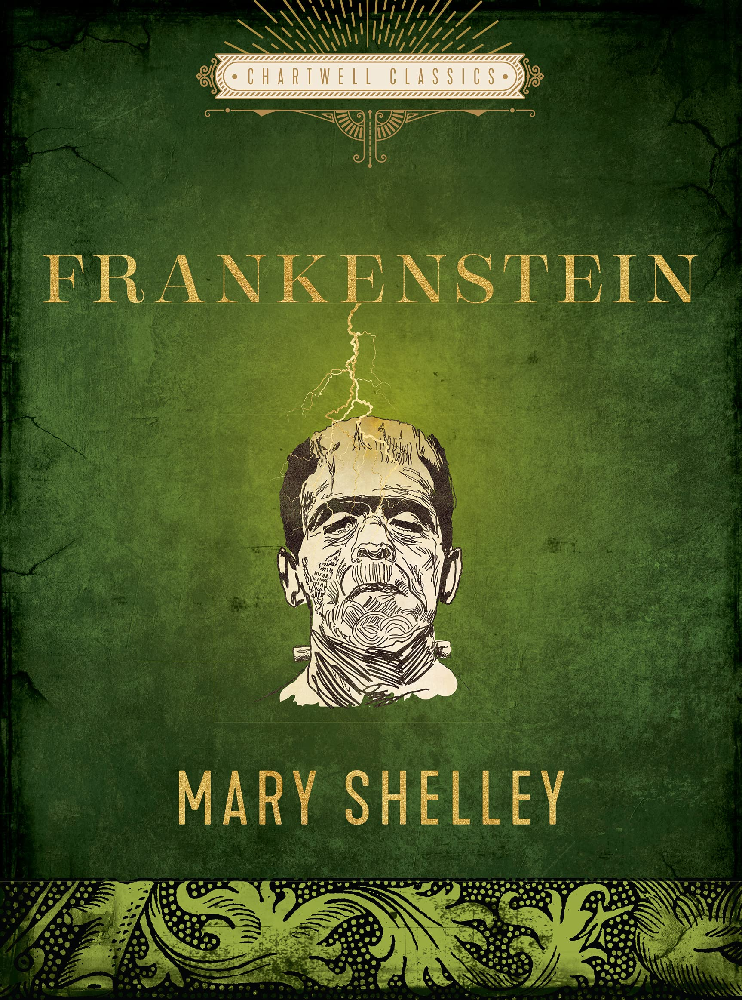
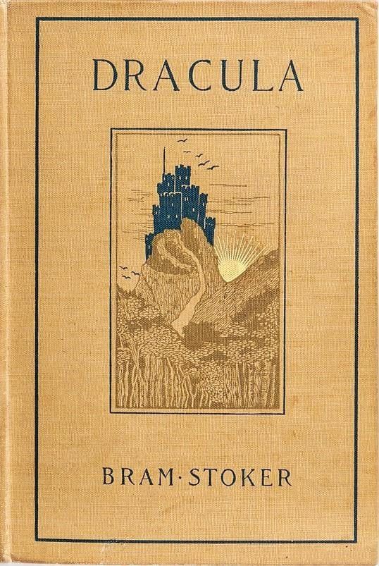

::: {layout-ncol=3}





:::

```{r}
#| include: false
library(gutenbergr)
library(tidyverse)
library(tidytext)
library(textdata)
library(scales)
library(ggrepel)
```

```{r}
#| include: false
# Project Gutenberg IDs:
# 1342 = Pride and Prejudice by Jane Austen
# 84   = Frankenstein by Mary Shelley
# 345  = Dracula by Bram Stoker
# if the CSV already exists read from saved file
# if not download the books and save as CSV
# 
# if (file.exists("classic_novels_raw.csv")) {
#   books_raw <- read_csv("classic_novels_raw.csv", show_col_types = FALSE)
# } else {
#   books_raw <- gutenberg_download(
#     gutenberg_id = c(1342, 84, 345),
#     meta_fields  = c("title", "author"),
#     mirror       = "http://mirrors.xmission.com/gutenberg/"
#   )
#   write_csv(books_raw, "classic_novels_raw.csv")
# }
```

```{r}
#| include: false
# # clean the raw text using regular expressions
# # str_squish removes extra whitespace
# # regex anchors (^) find the true story start for each novel
# # filters remove chapter headings, volume labels, and Gutenberg boilerplate
# 
# books_clean <- books_raw |>
#   mutate(
#     title = case_when(
#       str_detect(title, regex("Pride and Prejudice", ignore_case = TRUE)) ~ "Pride and Prejudice",
#       str_detect(title, regex("Frankenstein",        ignore_case = TRUE)) ~ "Frankenstein",
#       str_detect(title, regex("Dracula",             ignore_case = TRUE)) ~ "Dracula",
#       TRUE ~ title
#     ),
#     text = str_squish(text)
#   ) |>
#   filter(text != "") |>
#   group_by(title) |>
#   mutate(
#     line_num = row_number(),
#     # use ^ anchor to find the exact first line of each novel's narrative
#     # skips Gutenberg legal header at the top of every file
#     story_start = case_when(
#       title == "Pride and Prejudice" ~ str_detect(
#         text, regex("^It is a truth universally acknowledged", ignore_case = TRUE)
#       ),
#       title == "Frankenstein" ~ str_detect(
#         text, regex("^You will rejoice to hear", ignore_case = TRUE)
#       ),
#       title == "Dracula" ~ str_detect(
#         text, regex("^_3 May", ignore_case = TRUE)
#         # Dracula's opening line starts with _3 May in the Gutenberg file
#       ),
#       TRUE ~ FALSE
#     )
#   ) |>
#   mutate(start_line = min(line_num[story_start], na.rm = TRUE)) |>
#   filter(line_num >= start_line) |>
#   ungroup() |>
#   # remove structural labels using regex — not narrative content
#   filter(!str_detect(text, regex("^chapter\\b",      ignore_case = TRUE))) |>
#   # ^ = start of string, \\b = word boundary
#   filter(!str_detect(text, regex("^volume\\b",       ignore_case = TRUE))) |>
#   filter(!str_detect(text, regex("^book\\b",         ignore_case = TRUE))) |>
#   filter(!str_detect(text, regex("^\\[illustration", ignore_case = TRUE))) |>
#   # \\[ escapes the bracket which is a special regex character
#   filter(!str_detect(text, regex("project gutenberg", ignore_case = TRUE))) |>
#   select(gutenberg_id, title, author, line_num, text)
```

```{r}
#| include: false
# load stop words lexicon
data(stop_words)
# stop_words contains common English words with no analytical value
# e.g. "the", "a", "is", "he", "she", "was", "of", "in"
# three lexicons combined: onix, SMART, and snowball

# --- unigram tokenization ---
# unnest_tokens splits each line into individual words
# also lowercases everything and removes punctuation automatically

# tidy_books <- books_clean |>
#   unnest_tokens(
#     output = word,
#     input  = text,
#     token  = "words"
#   ) |>
#   filter(!word %in% stop_words$word) |>
#   # remove stop words — dramatically reduces noise
#   filter(!str_detect(word, "^\\d+$")) |>
#   # remove pure numbers: ^ = start, \\d+ = one or more digits, $ = end
#   filter(!word %in% c("s", "t", "d", "ll", "ve", "re", "m")) |>
#   # remove possessive and contraction remnants after tokenizing
#   # e.g. "elizabeth's" becomes "elizabeth" + "s" — the "s" is meaningless
#   filter(nchar(word) > 1)
#   # remove single-character tokens which are usually punctuation remnants
```

```{r}
#| include: false
# --- bigram tokenization ---
# extract two-word consecutive phrases (ngrams where n = 2)
# bigrams capture context that single words cannot
# e.g. "not happy", "blood red", "dear friend" carry different meaning
# than their individual words suggest

# bigrams <- books_clean |>
#   unnest_tokens(
#     output = bigram,
#     input  = text,
#     token  = "ngrams",
#     n      = 2
#     # n = 2 means consecutive pairs of words
#   ) |>
#   filter(!is.na(bigram)) |>
#   separate(bigram, into = c("word1", "word2"), sep = " ") |>
#   # split into two columns so we can filter stop words from each independently
#   filter(!word1 %in% stop_words$word) |>
#   filter(!word2 %in% stop_words$word) |>
#   # remove bigrams where either word is a stop word
#   filter(!str_detect(word1, "^\\d+$")) |>
#   filter(!str_detect(word2, "^\\d+$")) |>
#   unite(bigram, word1, word2, sep = " ") |>
#   # rejoin the two word columns back into one bigram column
#   count(title, bigram, sort = TRUE)
```

```{r}
#| include: false
# # load the bing lexicon — classifies words as positive or negative
# bing <- tidytext::get_sentiments("bing")
# 
# # --- sentiment arc across the narrative ---
# # divide each book into chunks of 80 lines
# # calculate net sentiment (positive minus negative words) per chunk
# 
# sentiment_arc <- books_clean |>
#   mutate(chunk = line_num %/% 80) |>
#   # %/% is integer division — groups every 80 lines into one chunk
#   unnest_tokens(word, text) |>
#   filter(!word %in% stop_words$word) |>
#   inner_join(bing, by = "word") |>
#   # inner_join keeps only words that have a bing sentiment match
#   count(title, chunk, sentiment) |>
#   pivot_wider(
#     names_from  = sentiment,
#     values_from = n,
#     values_fill = 0
#     # values_fill = 0 so chunks with no matches get 0 not NA
#   ) |>
#   mutate(net_sentiment = positive - negative)
#   # positive = more positive words, negative = more negative words
```

```{r}
#| include: false
# # load the NRC lexicon — classifies words into 8 emotions
# nrc <- tidytext::get_sentiments("nrc")
# # 8 emotions: anger, anticipation, disgust, fear, joy, sadness, surprise, trust
# # plus overall positive and negative
# 
# # count NRC emotions per book and convert to proportions
# # proportions make comparison fair since books have different lengths
# 
# emotion_counts <- tidy_books |>
#   left_join(nrc, by = "word", relationship = "many-to-many") |>
#   # many-to-many: one word can belong to multiple emotions
#   filter(!is.na(sentiment)) |>
#   filter(!sentiment %in% c("positive", "negative")) |>
#   # keep only the 8 pure emotion categories
#   count(title, sentiment) |>
#   group_by(title) |>
#   mutate(pct = n / sum(n))
#   # proportion so books of different lengths are fairly compared
```

```{r}
#| include: false
# calculate tf-idf treating each book as one document
# bind_tf_idf needs: the word column, the document column, and the word count
# tf:     term frequency — how often word appears in this book
# idf:    inverse document frequency — log(n_docs / docs_containing_word)
#         words in all 3 books get idf = 0 (not unique to any one book)
# tf_idf: product of tf and idf — high = frequent here, rare in the other two
# 
# tfidf <- tidy_books |>
#   count(title, word) |>
#   bind_tf_idf(word, title, n) |>
#   group_by(title) |>
#   slice_max(tf_idf, n = 12) |>
#   # top 12 most uniquely characteristic words per book
#   ungroup()
# 
# # consistent color palette used across both visualizations
# book_colors <- c(
#   "Pride and Prejudice" = "#2ecc71",
#   "Frankenstein"        = "#8e44ad",
#   "Dracula"             = "#c0392b"
# )
```

---

As frequent book readers, we usually attach labels to novels: Pride and Prejudice
is the romance, Frankenstein is the monster story, and Dracula is the vampire
horror. But those labels only tell us what the books are about, not how they
create the feelings we associate with them. In this project, we work directly
with those three famous novels, namely Jane Austen's Pride and Prejudice (1813),
Mary Shelley's Frankenstein (1818), and Bram Stoker's Dracula (1897), as data.
We wanted to explore whether the words themselves reveal why these books feel so
different. We will be looking at word frequency, bigrams, sentiment, emotion
categories, and TF-IDF to trace how Austen builds a world of manners, marriage,
and reputation, while Shelley turns ambition toward guilt and isolation, and
Stoker creates an atmosphere of illness, death, and supernatural fear.

## Data and Method

To explore the language of each novel, we used the full texts of Pride and
Prejudice, Frankenstein, and Dracula from Project Gutenberg. All three novels
are public-domain texts, which makes them accessible for this kind of comparison.
Before analyzing them, we cleaned the files to work with the actual stories
rather than irrelevant material such as publication notes, chapter headings, or
formatted text. After cleaning, the dataset contained 12,981 lines from Dracula,
10,846 lines from Pride and Prejudice, and 6,359 lines from Frankenstein.

From there, we broke the novels into individual words and removed common words
such as "the," "a," "is," and "of," which appear frequently but do not tell us
much about each book's unique style. This yielded 113,129 meaningful word tokens
for analysis. With the text prepared, we began asking questions, such as: which
words appear most often, which phrases repeat, how the emotional mood shifts
across each novel, and which words make each book stand apart from the others?

## Word Counts: The First Literary Clues

The first clues came from the words each novel repeats most often. In Dracula,
frequent words such as "night," "door," "Lucy," "Mina," "Van," and "Helsing"
immediately evoke a world of darkness, entrances, danger, and common pursuit.
Suppose we have not read the novel; this vocabulary somehow forms, in our minds,
a story built around fear and a group of characters trying to understand a threat
they cannot fully control.

Frankenstein creates a distinct atmosphere. Its common words are "life," "father,"
"eyes," "mind," and "Elizabeth," which point less to external danger and more to
creation, memory, family, and inner suffering. The word "life" is especially
important because, in the book, Victor's desire to create life also leads to
guilt, loss, and tragedy. The fact that Shelley repeatedly uses these words
implies a novel formed by emotional and moral consequences.

In Pride and Prejudice, the most common words are "Elizabeth," "Darcy," "Bennet,"
"Jane," and "Bingley", reflecting the novel's focus on relationships, reputation,
and social judgment. Unlike Dracula and Frankenstein, the stakes are social
rather than life-or-death, centering on misunderstanding and choice.

```{r}
#| echo: false
# most common words per book after removing stop words
# tidy_books |>
#   count(title, word, sort = TRUE) |>
#   group_by(title) |>
#   slice_max(n, n = 10) |>
#   print(n = 30)
```

## Bigrams: Seeing Words in Context

To get a better sense of each novel's language, we looked not only at individual
words but also at repeated two-word phrases — bigrams. In Dracula, the most
common bigrams are names and titles such as "Van Helsing," "Madam Mina,"
"Lord Godalming," and "Dr. Seward," which shows how much the novel depends on
a group of characters working together against a shared supernatural threat.
In Frankenstein, expressions such as "natural philosophy," "native country,"
"dear Victor," and "fellow creatures" point to a more personal and philosophical
world, where scientific ambition is tied to memory, loneliness, and the
creature's desire to belong. In Pride and Prejudice, bigrams such as
"Lady Catherine," "Miss Bingley," "Miss Bennet," and "Sir William" demonstrate
how significantly Austen's world is defined by titles, family names, rank,
and reputation.

```{r}
#| echo: false
# top 10 most common bigrams per book
# bigrams |>
#   group_by(title) |>
#   slice_max(n, n = 10) |>
#   print(n = 30)
```

## Sentiment Arc: Emotional Movement Through the Novels

The visualization below displays the sentiment arc of each novel. We divided
each book into 80-line chunks and calculated net sentiment by subtracting the
number of negative words from the number of positive words. This allows us to
see how the emotional tone changes from the beginning to the end of each story.

```{r}
#| echo: false
#| fig-width: 11
#| fig-height: 7
# 
# ggplot(sentiment_arc, aes(x = chunk, y = net_sentiment, color = title)) +
# 
#   geom_line(alpha = 0.3, linewidth = 0.55) +
#   # faint raw sentiment line shows actual chunk-by-chunk volatility
# 
#   geom_smooth(
#     se        = FALSE,
#     method    = "loess",
#     span      = 0.3,
#     linewidth = 1.5
#   ) +
#   # loess smoother reveals the overall emotional arc
#   # same method used in professor's Macbeth speaking pattern example
#   # span = 0.3 makes the curve responsive to local patterns without overfitting
# 
#   geom_hline(
#     yintercept = 0,
#     linetype   = "dashed",
#     color      = "grey50",
#     linewidth  = 0.7
#   ) +
#   # reference line — above zero = net positive, below zero = net negative
# 
#   annotate(
#     "text", x = 1, y = 3,
#     label    = "More positive \u2191",
#     color    = "grey45", size = 3, fontface = "italic", hjust = 0
#   ) +
#   annotate(
#     "text", x = 1, y = -3,
#     label    = "More negative \u2193",
#     color    = "grey45", size = 3, fontface = "italic", hjust = 0
#   ) +
# 
#   scale_color_manual(values = book_colors, name = NULL) +
#   facet_wrap(~title, scales = "free_x") +
#   # one panel per book, free x scale since books have different lengths
# 
#   labs(
#     title    = "The Emotional Journey: Sentiment Arc Across Three Classic Novels",
#     subtitle = "Each point = 80 lines | Smoothed loess curve shows overall emotional trajectory",
#     x        = "Narrative Progression (chunk of 80 lines)",
#     y        = "Net Sentiment (positive - negative words)",
#     caption  = "Source: Project Gutenberg via gutenbergr R package | Lexicon: Bing (Liu 2004)"
#   ) +
#   theme_minimal(base_size = 13) +
#   theme(
#     plot.title       = element_text(face = "bold", size = 15),
#     plot.subtitle    = element_text(color = "grey40"),
#     legend.position  = "none",
#     panel.grid.minor = element_blank(),
#     strip.text       = element_text(face = "bold", size = 12)
#   )
```

The sentiment arc helps show that each novel builds tension in its own way.
Pride and Prejudice has a more stable emotional pattern, but it still includes
noticeable dips during moments of rejection, misunderstanding, embarrassment,
and family scandal. Austen's conflicts are usually social rather than physical.
The tension comes from reputation, marriage pressure, and how characters judge
or misread one another. Because of this, the novel's emotional movement appears
less like a crisis of survival and more like a journey toward comprehension,
reconciliation, and marriage.

Frankenstein, in contrast, follows a darker emotional path. The story begins
with Victor's curiosity and scientific zeal, but the mood grows increasingly
dark as his creation leads to abandonment, guilt, and the deaths of those he
loves. The sentiment arc supports what readers frequently feel while reading
the novel: Frankenstein moves from hope and discovery into isolation,
responsibility, and destruction. Shelley's emotional pattern reflects one of
the novel's central warnings — ambition becomes dangerous when it is separated
from care and responsibility.

Dracula is the most emotionally unpredictable of the three. Instead of taking
one steady emotional direction, it moves through repeated moments of fear,
uncertainty, temporary hope, and renewed danger. This makes sense because the
novel is told through diaries, letters, and telegrams from multiple characters,
so the emotional mood shifts as different voices respond to the threat of Dracula.

## Emotion Analysis: Fear and Joy

We used the NRC lexicon to classify words into emotional groups — fear, joy,
anger, sadness, trust, surprise, disgust, and anticipation. Since the lengths
of the novels varied significantly, we compared the proportions of raw counts
across emotion groups.

The results for fear words confirmed our expectations. Dracula contains the
highest proportion of fear words (16.3%), followed by Frankenstein (15.7%),
and Pride and Prejudice (10.5%). Fear in Dracula is represented by themes of
supernatural threat, illness, pursuit, and death. Fear in Frankenstein is tied
to guilt, isolation, and moral consequences. Fear in Pride and Prejudice is
primarily social — the fear of embarrassment, rejection, and a damaged reputation.

The results for joy words were the opposite. Pride and Prejudice contains the
highest proportion of joy words (17.3%), followed by Frankenstein (13.3%), and
Dracula (12.3%). This suggests that although Austen's novel has a strong element
of conflict throughout the plot, it contains the most positive emotional world
overall — consistent with its genre as a romantic comedy that ends in happiness.

## TF-IDF: Each Novel's Literary Fingerprint

The visualization below uses TF-IDF to identify words that are especially
distinctive to one book compared to the others. TF-IDF helps us find the words
that define each novel's unique vocabulary — words that appear frequently in one
book but rarely in the other two.

```{r}
#| echo: false
#| fig-width: 11
#| fig-height: 8
# 
# tfidf |>
#   mutate(word = reorder_within(word, tf_idf, title)) |>
#   # reorder_within reorders words within each facet panel independently
#   # without this all panels would use the same word order
# 
#   ggplot(aes(x = tf_idf, y = word, color = title)) +
# 
#   geom_segment(
#     aes(x = 0, xend = tf_idf, y = word, yend = word),
#     linewidth = 1.0, alpha = 0.65
#   ) +
#   # the stick of the lollipop — drawn from 0 to the tf_idf value
# 
#   geom_point(size = 4.5, alpha = 0.95) +
#   # the dot of the lollipop
# 
#   geom_text(
#     aes(label = word),
#     hjust = -0.25, size = 3.1, fontface = "bold"
#   ) +
#   # word labels placed just to the right of each dot
# 
#   scale_y_reordered() +
#   # required after reorder_within to clean up axis labels
# 
#   scale_color_manual(values = book_colors) +
#   scale_x_continuous(expand = expansion(mult = c(0, 0.4))) +
#   # extra space on the right so word labels are not cut off
# 
#   facet_wrap(~title, scales = "free_y") +
#   # one panel per book, free y scale so each book shows its own words
# 
#   labs(
#     title    = "Literary Fingerprints: The Words That Define Each Novel",
#     subtitle = "Top 12 words by TF-IDF score — higher = more unique to that book vs the other two",
#     x        = "TF-IDF Score",
#     y        = NULL,
#     caption  = "Source: Project Gutenberg via gutenbergr R package"
#   ) +
#   theme_minimal(base_size = 13) +
#   theme(
#     plot.title         = element_text(face = "bold", size = 15),
#     plot.subtitle      = element_text(color = "grey40"),
#     legend.position    = "none",
#     panel.grid.minor   = element_blank(),
#     panel.grid.major.y = element_blank(),
#     strip.text         = element_text(face = "bold", size = 12)
#   )
```

The TF-IDF analysis shows each book has a unique literary fingerprint. The most
distinctive word in Dracula is "Van," referring to Van Helsing. Related words
include "Helsing," "Lucy," "Mina," "Jonathan," "Count," "Harker," and "Diary."
This shows how Stoker's novel is dominated by its characters and written in a
documentary style. The repeated use of character names indicates that the novel
presents multiple perspectives on events, while the word "Diary" suggests that
letters, journals, and records are used to organize the story.

In Frankenstein, the most distinctive words are "Clerval" (Victor's close
friend), "Justine," "Cottage," "Felix," "Geneva," "Elizabeth," "Victor,"
"Creator," and "Murderer." These words indicate that Shelley's novel is about
more than science or horror — it explores friendship, family, guilt, exile,
creation, and loss. The contrast between "Creator" and "Murderer" illustrates
Victor's moral failure: while he gives life to his creation, he refuses to
take responsibility for it.

Austen's Pride and Prejudice has an obvious focus on social relationships and
class, defined through words such as "Darcy," "Bennet," "Jane," "Bingley,"
"Elizabeth," "Wickham," "Collins," "Lydia," and "Longbourn." While both
Dracula and Frankenstein have names tied to shared struggles against evil or
moral accountability, the names in Pride and Prejudice create identities that
reflect relationships to family, marriage, and reputation.

## Conclusion

Pride and Prejudice, Frankenstein, and Dracula differ not only in plot and
genre, but also in the emotional worlds they create through language. Austen's
novel is defined by relationships, reputation, marriage, and social observation.
Shelley's novel moves through ambition, guilt, isolation, creation, and loss.
Stoker's novel builds a world of fear, urgency, and supernatural threat.

Text analysis cannot fully capture irony, symbolism, or narrative complexity,
especially in a novel like Pride and Prejudice where much of Austen's meaning
derives from subtle social critique. Still, these methods help us see patterns
that are easy to miss in a traditional reading. By turning words into data, we
can better understand how Austen, Shelley, and Stoker each build a distinct
literary atmosphere — one built on social performance, one on moral consequence,
and one on collective survival against the unknown.


## References

- [Pride and Prejudice cover](https://www.amazon.com/Pride-Prejudice-Original-Austen-Classic/dp/B0DK41XQJ2) 
- [Frankenstein cover](https://www.amazon.com/Frankenstein-Chartwell-Classics-Mary-Shelley/dp/0785839887)
- [Dracula cover](https://www.pixartprinting.co.uk/blog/dracula-covers-book/)
- [Project Gutenberg](https://www.gutenberg.org)
- [gutenbergr R package](https://docs.ropensci.org/gutenbergr)
- [Text Mining with R (Silge & Robinson)](https://www.tidytextmining.com)
